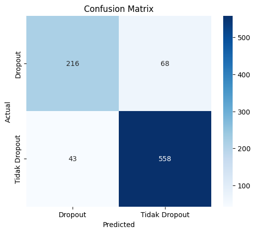
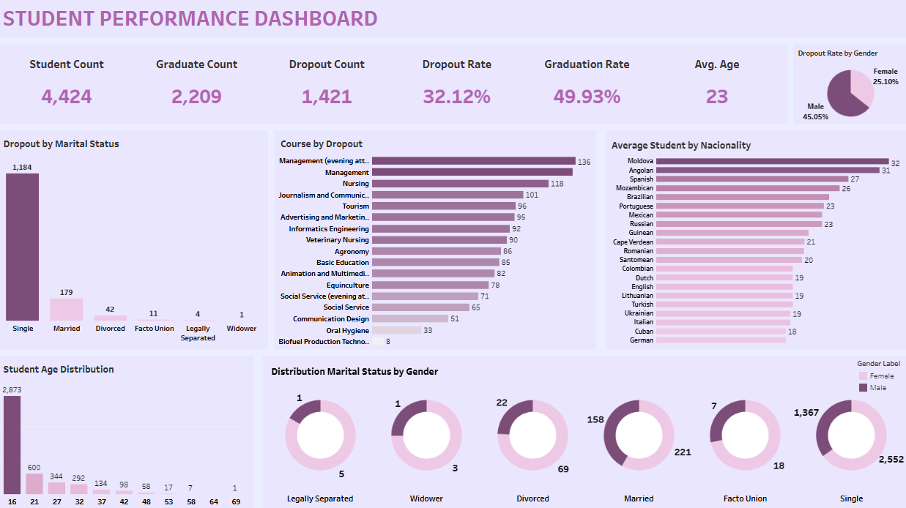

# 🎓 Proyek Akhir: Menyelesaikan Permasalahan Perusahaan Edutech

## Business Understanding
Jaya Jaya Institut merupakan salah satu institusi pendidikan perguruan yang telah berdiri sejak tahun 2000. Hingga saat ini ia telah mencetak banyak lulusan dengan reputasi yang sangat baik. Akan tetapi, terdapat banyak juga siswa yang tidak menyelesaikan pendidikan alias *dropout*.

Jumlah *dropout* yang tinggi ini tentunya menjadi salah satu masalah yang besar untuk sebuah institusi pendidikan. Oleh karena itu, Jaya Jaya Institut ingin mendeteksi secepat mungkin siswa yang mungkin akan melakukan *dropout* sehingga dapat diberi bimbingan khusus.

### 🎯 Permasalahan Bisnis
- Tingginya angka *dropout* berdampak negatif terhadap reputasi institusi.
- Tidak adanya sistem prediktif untuk mengidentifikasi siswa berisiko tinggi *dropout* sejak dini.
- Kesulitan memberikan intervensi tepat waktu akibat keterbatasan informasi dan sumber daya.

### 📦 Cakupan Proyek
- Menganalisis data historis mahasiswa (akademik, finansial, sosial).
- Membangun model machine learning untuk memprediksi kemungkinan *dropout*.
- Mengembangkan prototipe sistem prediksi berbasis web menggunakan **Streamlit**.
- Menyediakan dashboard interaktif (Tableau) untuk visualisasi performa dan distribusi data.

### 🛠️ Persiapan
**Sumber Data:** Berikut link dataset beserta penjelasan lengkap setiap kolom data [Student's Performance Dataset](https://github.com/dicodingacademy/dicoding_dataset/blob/main/students_performance/README.md)

**Setup Environment:**
```bash
pip install -r requirements.txt
```

---

## 📊 Evaluasi Model XGBoost dan Analisis Dropout Mahasiswa
Pada tahap modeling saya memilih menggunakan XGBoost karena performa yang baik pada data tabular, dukungan terhadap missing values, serta kemampuan menangani ketidakseimbangan kelas.

Setelah dilakukan pelatihan dan tuning hyperparameter menggunakan GridSearchCV, model XGBoost menghasilkan performa yang cukup solid:

- **Best Parameters:**
  ```python
  {
    'learning_rate': 0.1,
    'max_depth': 7,
    'n_estimators': 100,
    'subsample': 0.8
  }

- **Classification Report**

| Class               | Precision | Recall | F1-score | Support |
|---------------------|-----------|--------|----------|---------|
| 0 (Dropout)         | 0.83      | 0.76   | 0.80     | 284     |
| 1 (Tidak Dropout)   | 0.89      | 0.93   | 0.91     | 601     |
| **Accuracy**        |           |        | **0.87** | **885** |
| **Macro Avg**       | 0.86      | 0.84   | 0.85     | 885     |
| **Weighted Avg**    | 0.87      | 0.87   | 0.87     | 885     |

Model menunjukkan akurasi keseluruhan sebesar 87%, dengan performa yang sedikit lebih baik dalam memprediksi kelas mayoritas (tidak dropout). Hal ini lumrah dalam konteks data yang tidak seimbang.

- **Confusion Matrix**
<p align="center">

</p>
<p align="center">Confusion Matrix</p>

Recall untuk kelas dropout (0.76) sedikit lebih rendah dibanding tidak dropout (0.93), menandakan beberapa kasus dropout masih gagal terdeteksi.

- **Feature Importance**
Model XGBoost mengindikasikan bahwa beberapa fitur paling berpengaruh terhadap prediksi dropout adalah:

| Rank | Feature                             | Importance     |
|------|-------------------------------------|----------------|
| 1    | Curricular_units_2nd_sem_approved   | Sangat tinggi  |
| 2    | Tuition_fees_up_to_date_1           | Tinggi         |
| 3    | Curricular_units_1st_sem_enrolled   | Sedang         |
| 4    | Debtor_1                             | Sedang         |
| ...  | ...                                 | ...            |

Fitur akademik seperti jumlah mata kuliah yang disetujui dan status keuangan siswa (tunggakan pembayaran) memiliki dampak besar pada kemungkinan dropout.


## 📊 Business Dashboard

Dashboard dibuat menggunakan **Tableau** untuk menyajikan statistik penting mengenai mahasiswa, khususnya yang terkait dengan *dropout analysis*.

🔗 **Link Akses Dashboard:**  
[Student Performance Dashboard – Tableau](https://public.tableau.com/views/StudentPerformanceDashboardJayaInstitute/StudentPerformanceDashboard?:language=en-US&:sid=&:redirect=auth&:display_count=n&:origin=viz_share_link)

<p align="center">

</p>
<p align="center">Student Performance Dashboard</p>

### 🔢 Ringkasan Statistik Utama
- **Total Mahasiswa:** 4,424
- **Jumlah Lulusan:** 2,209
- **Jumlah Dropout:** 1,421
- **Dropout Rate:** 32.12%
- **Graduation Rate:** 49.93%
- **Rata-rata Usia:** 23 tahun
- **Dropout by Gender:**  
  - Laki-laki: 45.05%  
  - Perempuan: 25.10%

### 📉 Dropout Berdasarkan Status Pernikahan
- **Single** mendominasi dropout dengan 1,184 kasus.
- Korelasi dengan usia muda dan minimnya support system menjadi faktor utama.

### 🎓 Dropout Berdasarkan Program Studi
Program studi dengan dropout tertinggi:
1. Management (evening): 136
2. Management: 118
3. Nursing: 101
4. Journalism & Communication: 96

### 🌍 Rata-rata Mahasiswa Berdasarkan Kewarganegaraan
- Negara terbanyak: Moldova (32), Angola (31), Spanyol (27)
- Indikasi adanya faktor adaptasi budaya dan bahasa yang memengaruhi dropout.

### 📊 Distribusi Usia Mahasiswa
- Usia 16–21 tahun mendominasi (tertinggi di usia 16 = 2,873 siswa).
- Usia muda berisiko tinggi karena masih rentan terhadap tekanan akademik.

### 🧩 Distribusi Status Pernikahan per Gender
- **Laki-laki** mendominasi hampir semua kategori *dropout*, terutama:
  - Single: 1,367 dari 2,552
  - Married: 158 dari 179

---
## 🤖 Menjalankan Sistem Machine Learning

Model menggunakan algoritma **XGBoost** dengan optimasi menggunakan **GridSearchCV**. Aplikasi prototipe dibangun menggunakan **Streamlit**.

### ▶️ Jalankan Aplikasi Lokal:
```bash
streamlit run app.py
```

🔗 *Link prototype (jika tersedia online):*  
[link streamlit](https://jayajayajayadashboard123.streamlit.app/)

---

## ✅ Conclusion

Model prediksi dropout berbasis XGBoost berhasil dibangun dengan akurasi cukup tinggi (**87%**). Model ini mampu mengidentifikasi siswa berisiko tinggi *dropout* berdasarkan faktor akademik, keuangan, dan sosial.

Dashboard mendukung pemahaman visual yang membantu pengambil keputusan dalam mendesain intervensi lebih cepat dan tepat sasaran.

---

## 💡 Rekomendasi Action Items

- 🎯 **Implementasi Sistem Peringatan Dini:**  
  Gunakan model untuk mendeteksi siswa berisiko tinggi secara real-time.

- 📈 **Fokus Intervensi pada Mahasiswa Rentan:**  
  Terutama mahasiswa muda, single, laki-laki, dengan beban akademik tinggi dan masalah keuangan.

- 💬 **Dukungan Sosial & Akademik Tambahan:**  
  Seperti mentoring, konseling, dan program beasiswa.

- 🗂️ **Peningkatan Data & Monitoring:**  
  Perluas variabel yang dikumpulkan untuk menyempurnakan model (misalnya, kehadiran, partisipasi kelas, aktivitas organisasi).

